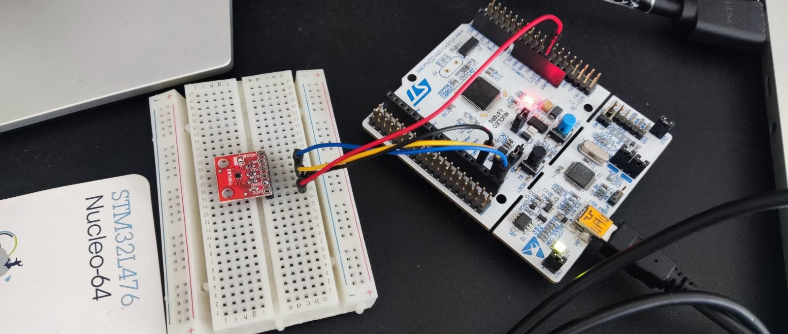

# Read Temperature Using Rust, TMP102 and Nucleo L476RG

<video controls src="demo.mp4" title="Title"></video>
This project demonstrates how to read temperature data from a TMP102 sensor connected to an STM32 Nucleo L476RG board, using Rust and UART communication to send the data to a PC.

## Table of Contents
1. [Environment Setup](#wsl2-environment-setup)
2. [Project Setup](#project-setup)
3. [Using TMP102 Sensor](#using-tmp102-sensor)
4. [Debugging](#debugging)
5. [Viewing Temperature Data](#viewing-temperature-data)

---

## WSL2 Environment Setup

To work with STM32 on a WSL2 environment, you'll need to set up access to the ST-Link debugger.

### Step 1: Connect ST-Link to WSL2

Make sure the ST-Link device is connected to your system. You can use `usbipd` to attach the ST-Link to WSL2. Here’s how to do it:

1. **List available USB devices**:
    ```bash
    usbipd list
    ```

    Example output:
    ```bash
    PS C:\Users\usr1> usbipd list
    Connected:
    BUSID  VID:PID    DEVICE                                                        STATE
    1-2    046d:c52b  Logitech USB Input Device, USB Input Device                   Not shared
    2-2    0483:374b  ST-Link Debug, USB Mass Storage Device, USB Serial Device...  Shared
    2-3    0489:e0cd  MediaTek Bluetooth Adapter                                    Shared
    2-4    04f2:b6be  Integrated Camera, Integrated IR Camera, Camera DFU Device    Not shared
    ```

2. **Attach the ST-Link to WSL2**:
    ```bash
    PS C:\Users\usr1> usbipd attach -a -i 0483:374b --wsl
    ```

    You should see messages indicating that the ST-Link device is attached to WSL2 and ready to use.

---

## Project Setup

To set up the development environment and initialize the Rust project:

### Step 1: Install Rust Toolchain

Follow the Rust Embedded book to set up the environment:  
[Setting up the Rust Embedded Environment](https://docs.rust-embedded.org/book/intro/tooling.html)

### Step 2: Initialize Cargo Template

You can use the `cortex-m-quickstart` template to bootstrap your embedded Rust project:

1. Install the template by following the instructions from the repository:  
   [Rust Embedded Cortex-M Quickstart](https://github.com/rust-embedded/cortex-m-quickstart)
   
2. Initialize the project:
    ```bash
    cargo generate --git https://github.com/rust-embedded/cortex-m-quickstart
    ```

### Step 3: Update your .cargo/config.toml

Starting [here](https://www.st.com/content/ccc/resource/technical/document/data_brief/c8/3c/30/f7/d6/08/4a/26/DM00105918.pdf/files/DM00105918.pdf/jcr:content/translations/en.DM00105918.pdf) we found that our MCU is [with FPU Arm Cortex-M4](https://www.st.com/en/microcontrollers-microprocessors/stm32l476rg.html?ecmp=tt9470_gl_link_feb2019&rt=db&id=DB2196).
Update section build in config.toml file:
```
[build]
target = "thumbv7em-none-eabihf"     # Cortex-M4F and Cortex-M7F (with FPU)
```
### Step 4: Update your memory.x file

Use [datasheet](https://www.st.com/en/microcontrollers-microprocessors/stm32l476rg.html?ecmp=tt9470_gl_link_feb2019&rt=db&id=DB2196) to find out memory address origins and lenghts, in this case it is:
```
FLASH : ORIGIN = 0x08000000, LENGTH = 1024K
RAM : ORIGIN = 0x20000000, LENGTH = 96K
```
---

## Using TMP102 Sensor

The TMP102 is a temperature sensor that communicates over the I2C protocol. You can find detailed information on how to connect and use the TMP102 sensor with the STM32 Nucleo L476RG from this guide:  
[Getting Started with STM32 and I2C TMP102](https://www.digikey.com/en/maker/videos/shawn-hymel/getting-started-with-stm32-and-nucleo-part-2-how-to-use-i2c-to-read-temperature-sensor-tmp102)

**I2C Setup**:
- Connect the TMP102 sensor to the I2C pins on the Nucleo board.
- Use the appropriate I2C library in your Rust project to communicate with the sensor.

---

## Debugging

### Step 1: OpenOCD Setup

You’ll need to use OpenOCD to interface with the Nucleo board and run your program.

1. Install OpenOCD on your system:
    ```bash
    sudo apt install openocd
    ```

2. Start OpenOCD using the configuration file for the Nucleo L476RG:
    ```bash
    sudo openocd -f /usr/share/openocd/scripts/board/st_nucleo_l476rg.cfg
    ```

### Step 2: GDB for Debugging

Once OpenOCD is running, you can use `gdb-multiarch` to load and debug your program on the Nucleo board.

1. Start GDB in your project directory:
    ```bash
    gdb-multiarch -q target/thumbv7m-none-eabi/debug/rusty-temp-reader
    ```

2. Connect GDB to the remote target (running on OpenOCD):
    ```bash
    target remote :3333
    ```

3. Load your program onto the board:
    ```bash
    load
    ```

You can now use GDB commands to step through and debug your Rust code running on the microcontroller.

---

## Viewing Temperature Data

### Step 1: Setup Minicom

To view the temperature data transmitted from the Nucleo board via UART, you can use `minicom` to read the serial output on your PC.

1. Install Minicom on your system:
    ```bash
    sudo apt install minicom
    ```

2. Start Minicom, specifying the baud rate and the UART device (typically `/dev/ttyACM0`):
    ```bash
    minicom -b 115200 -D /dev/ttyACM0
    ```

You should now see the temperature readings from the TMP102 sensor being printed in the Minicom terminal.

---

## Additional Resources

- [Rust Embedded Book](https://docs.rust-embedded.org/book/)
